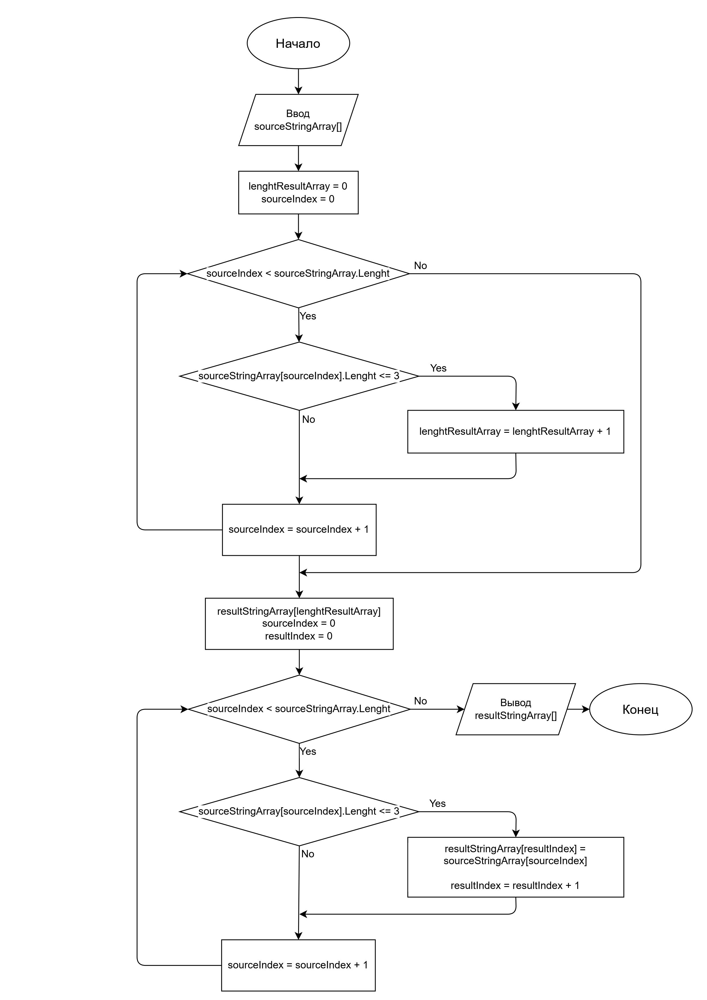

# Итоговая проверочная работа.

## Задача
Написать программу, которая из имеющегося массива строк формирует массив из строк, длина которых меньше либо равна 3 символа. Первоначальный массив можно ввести с клавиатуры, либо задать на старте выполнения алгоритма. При решении не рекомендуется пользоваться коллекциями, лучше обойтись исключительно массивами.

**Примеры**:

["hello", "2", "world", ":-)"] -> ["2", ":-)"]

["1234", "1567", "-2", "computer science"] -> ["-2"]

["Russia", "Denmark", "Kazan"] -> []

## Описание решения
Первым этапом необходимо определить, какое количество строк в исходном массиве соответстствует заданным параметрам, т.е. имеет длину не более 3 символов. Для этого необходимо в цикле проверить длину каждой строки в исходном массиве и, если длина строки не превышает 3 символа, инкрементировать переменную-счетчик.
После того, как количество искомых строк будет известно, можно объявить массив для сохранения результата работы программы. Затем нужно снова в цикле перебрать элементы исходного массива и скопировать в новый массив строки с длиной не более 3.

## Блок-схема

